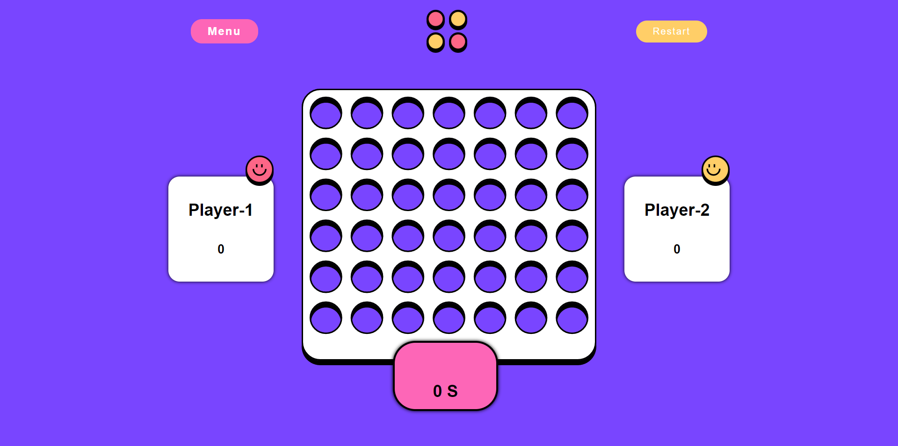

# Frontend Mentor - Connect Four game

## Welcome! 👋

Thanks for purchasing this premium Frontend Mentor coding challenge.

[Frontend Mentor](https://www.frontendmentor.io) challenges help you improve your coding skills by building realistic projects. These premium challenges are perfect portfolio pieces, so please feel free to use what you create in your portfolio to show others.

**To do this challenge, you need a strong understanding of HTML, CSS, and JavaScript.**

## The challenge

Your challenge is to build out this Connect Four game and get it looking as close to the design as possible.

You can use any tools you like to help you complete the challenge. So if you've got something you'd like to practice, feel free to give it a go.

Your users should be able to:

- View the game rules
- Play a game of Connect Four against another human player (alternating turns on the same computer)
- View the optimal layout for the interface depending on their device's screen size
- See hover and focus states for all interactive elements on the page
- **Bonus**: See the discs animate into their position when a move is made
- **Bonus**: Play against the computer

Want some support on the challenge? [Join our Slack community](https://www.frontendmentor.io/slack) and ask questions in the **#help** channel.

### Expected behaviour

- The initial screen should be the Main Menu. Note that if you want your solution screenshot to match the design, we recommend first submitting the solution showing the game in a clean state. Then editing your solution so that the Main Menu shows on the first load. Otherwise, the design comparison slider will show the Main Menu instead of the game board.
  - If you're not doing the bonus with the vs CPU option, simply remove that item from the Main Menu.
- Player 1 goes first in the first game. The first turn then alternates in subsequent games.
- When a player wins a round, the win state is shown, and the winning player's score is incremented by 1.
- Each player has 30 seconds to take their turn. The counter counts down in real time. If it reaches zero, the win state is shown for the other player and their score is incremented by 1.
- Clicking the Menu button on the game board opens up the Ingame Menu.
  - Clicking Quit Game from the Ingame Menu navigates to the Main Menu.
- Clicking the Restart button on the game board resets both players' scores to zero.

### Screenshot

### Links

- Solution URL: [Add solution URL here](https://github.com/rameshkmunjal/rameshkmunjal.github.io/tree/master/projects/files/games/2_connect-four-game)
- Live Site URL: [Add live site URL here](https://rameshkmunjal.github.io/projects/files/games/2_connect-four-game/index.html)

## My process

### Built with

- Semantic HTML5 markup
- CSS custom properties
- Javascript (VanillaJs)

### What I learned
    - This project gave me a great programming practice

### Continued development

    I hope to do such projects in future with greater efficiency  and clean code

### Useful resources
    stackoverflow.com
## Author

- Twitter - [@yourusername](https://www.twitter.com/tech_munjal)

