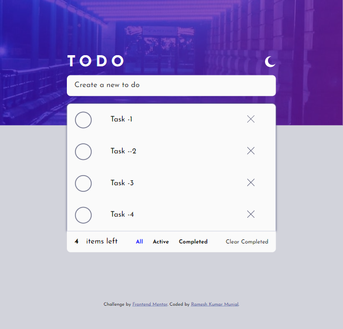

# Frontend Mentor - Todo app

## Welcome! 👋

Thanks for checking out this front-end coding challenge.

[Frontend Mentor](https://www.frontendmentor.io) challenges help you improve your coding skills by building realistic projects.

**To do this challenge, you need a good understanding of HTML, CSS and JavaScript.**

## The challenge

Your challenge is to build out this todo app and get it looking as close to the design as possible.

You can use any tools you like to help you complete the challenge. So if you've got something you'd like to practice, feel free to give it a go.

Your users should be able to:

- View the optimal layout for the app depending on their device's screen size
- See hover states for all interactive elements on the page
- Add new todos to the list
- Mark todos as complete
- Delete todos from the list
- Filter by all/active/complete todos
- Clear all completed todos
- Toggle light and dark mode
- **Bonus**: Drag and drop to reorder items on the list

Want some support on the challenge? [Join our Slack community](https://www.frontendmentor.io/slack) and ask questions in the **#help** channel.

### Screenshot

### Links

- Solution URL: [Add solution URL here](https://github.com/rameshkmunjal/rameshkmunjal.github.io/tree/master/projects/files/webapps/1-todolist)
- Live Site URL: [Add live site URL here](https://rameshkmunjal.github.io/projects/files/webapps/1-todolist/index.html)

## My process

### Built with

- Semantic HTML5 markup
- CSS custom properties
-Javascript (VanillaJs)

### What I learned
    - changing theme of page
    - filtering data as per click
### Continued development
    i wish to do more practice in vanilla js

### Useful resources

## Author
- Twitter - [@yourusername](https://www.twitter.com/tech_munjal)

