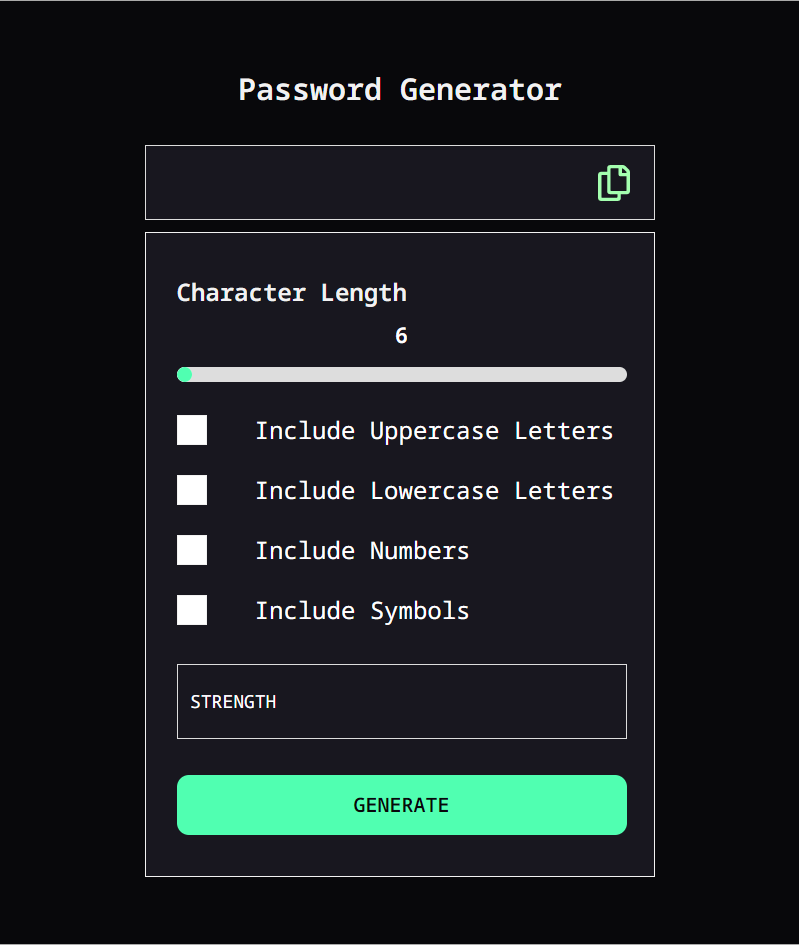

# Frontend Mentor - 

# Frontend Mentor - Password generator app

## Table of contents

- [Overview](#overview)
  - [The challenge](#the-challenge)
  - [Screenshot](#screenshot)
  - [Links](#links)
- [My process](#my-process)
  - [Built with](#built-with)
  - [What I learned](#what-i-learned)  
- [Author](#author)

## Overview

### The challenge

Your challenge is to build out password generator app and get it looking as close to the design as possible.

Users should be able to:

- Generate a password based on the selected inclusion options
- Copy the generated password to the computer's clipboard
- See a strength rating for their generated password
- View the optimal layout for the interface depending on their device's screen size
- See hover and focus states for all interactive elements on the page

### Screenshot

### Links

- Solution URL: [Add solution URL here](https://github.com/rameshkmunjal/rameshkmunjal.github.io/tree/master/projects/files/webapps/3_password_generator_app)
- Live Site URL: [Add live site URL here](https://rameshkmunjal.github.io/projects/files/webapps/3_password_generator_app/dist/index.html)

## My process

### Built with

- Semantic HTML5 markup
- CSS custom properties
- Flexbox
- SCSS
-Javascript (VanillaJs)

### What I learned

    - how to copy something on clipboard
    - turn ascii value to character
    - useing javascript with range slider
    - customised styling of checkboxes

### Continued development

    I hope to improve my knowledge in SCSS and semantic HTML in coming projects.

### Useful resources

## Author

- Twitter - [@yourusername](https://www.twitter.com/tech_munjal)

