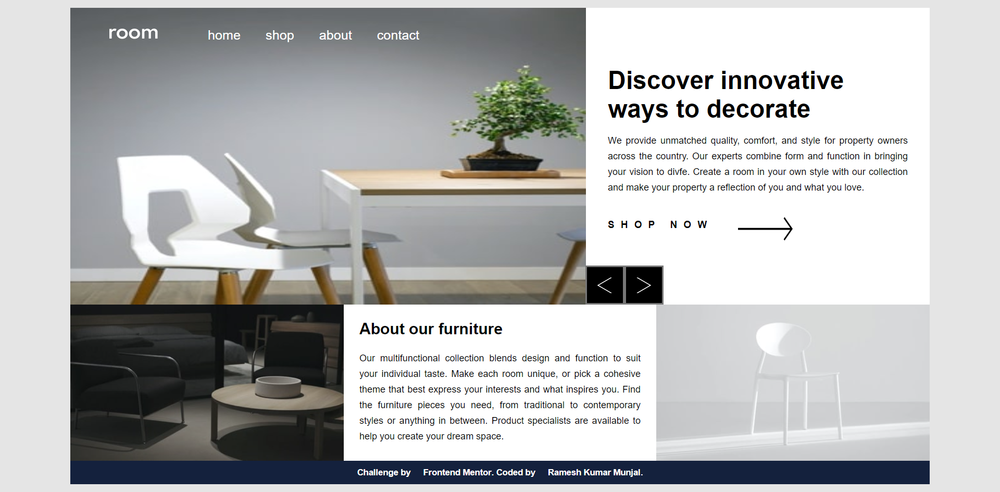

# Frontend Mentor - Room homepage solution

This is a solution to the [Room homepage challenge on Frontend Mentor](https://www.frontendmentor.io/challenges/room-homepage-BtdBY_ENq). Frontend Mentor challenges help you improve your coding skills by building realistic projects. 

## Table of contents

- [Overview](#overview)
  - [The challenge](#the-challenge)
  - [Screenshot](#screenshot)
  - [Links](#links)
- [My process](#my-process)
  - [Built with](#built-with)
  - [What I learned](#what-i-learned)  
- [Author](#author)

## Overview

### The challenge

Users should be able to:

- View the optimal layout for the site depending on their device's screen size
- See hover states for all interactive elements on the page
- Navigate the slider using either their mouse/trackpad or keyboard

### Screenshot

### Links

- Solution URL: [Add solution URL here](Solution URL: https://github.com/rameshkmunjal/rameshkmunjal.github.io/tree/master/projects/files/webpage/12_room_homepage)
- Live Site URL: [Add live site URL here](https://rameshkmunjal.github.io/projects/files/webpage/12_room_homepage/index.html)

## My process

### Built with

- Semantic HTML5 markup
- CSS custom properties
- Flexbox

### What I learned

image slider 

### Continued development
automatic image-slider and 3D-image slider

### Useful resources
youtube videos

## Author
- Twitter - (https://www.twitter.com/tech_munjal)

