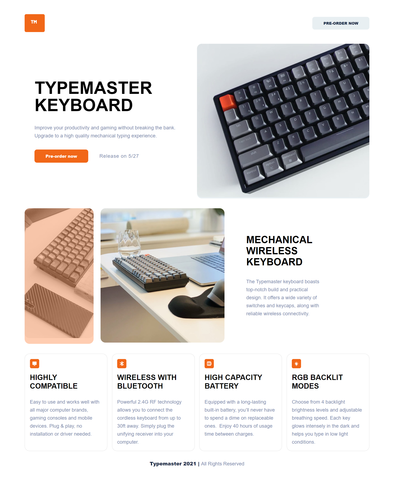

# Frontend Mentor - Typemaster pre-launch landing page

**To do this challenge, you need a good understanding of HTML and CSS.**

### Screenshot

### Links

- Solution URL: [Add solution URL here](https://github.com/rameshkmunjal/rameshkmunjal.github.io/tree/master/projects/files/webpage/17_typemaster_landing_page)
- Live Site URL: [Add live site URL here](https://rameshkmunjal.github.io/projects/files/webpage/17_typemaster_landing_page/index.html)

## My process

### Built with

- Semantic HTML5 markup
- CSS custom properties
- Flexbox, Grid

### What I learned
Grid Layout Practice

## Author

- Twitter - [@yourusername](https://www.twitter.com/tech_munjal)