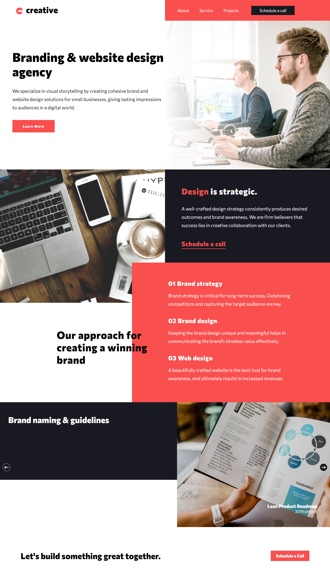

# Frontend Mentor - Creative agency single page site

## Welcome! 👋

Thanks for purchasing this premium Frontend Mentor coding challenge.

[Frontend Mentor](https://www.frontendmentor.io) challenges help you improve your coding skills by building realistic projects. These premium challenges are perfect portfolio pieces, so please feel free to use what you create in your portfolio to show others.

**To do this challenge, you need a solid understanding of HTML and CSS and a basic understanding of JavaScript.**

## The challenge

Your challenge is to build out this single-page website and get it looking as close to the design as possible.

You can use any tools you like to help you complete the challenge. So if you've got something you'd like to practice, feel free to give it a go.

Your users should be able to:

- View the optimal layout for the site depending on their device's screen size
- See hover states for all interactive elements on the page
- Navigate the slider using either their mouse/trackpad or keyboard

Want some support on the challenge? [Join our Slack community](https://www.frontendmentor.io/slack) and ask questions in the **#help** channel.

### Screenshot

### Links

- Solution URL: [Add solution URL here](https://github.com/rameshkmunjal/rameshkmunjal.github.io/tree/master/projects/files/webpage/18_creative_agency_page)
- Live Site URL: [Add live site URL here](https://rameshkmunjal.github.io/projects/files/webpage/18_creative_agency_page/index.html)

## My process

### Built with

- Semantic HTML5 markup
- CSS custom properties
- Flexbox, Grid

### What I learned
Grid Layout Practice

## Author

- Twitter - [@yourusername](https://www.twitter.com/tech_munjal)